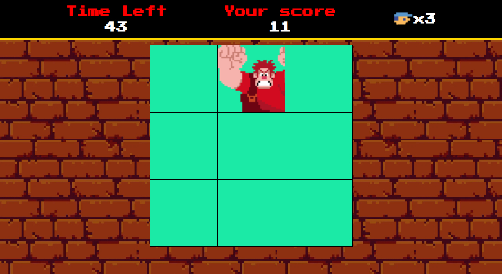
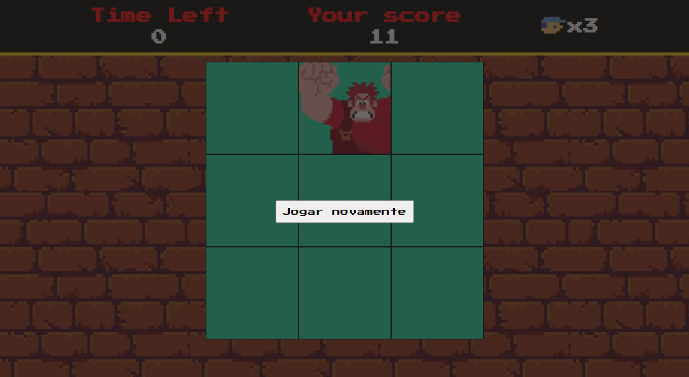
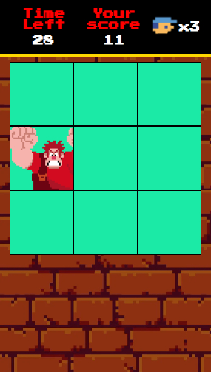
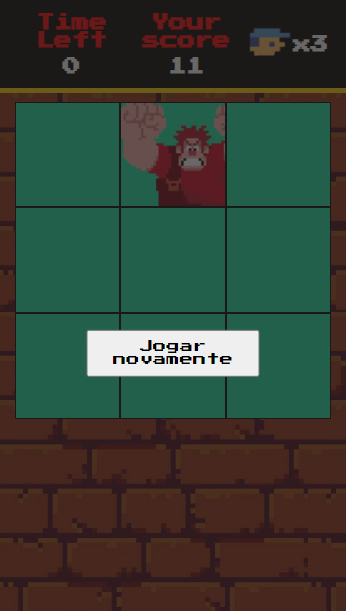

# Game Detona Ralph

## Sobre o projeto
Trata de um jogo baseado no filme "Detona Ralph". Este projeto não apenas oferece entretenimento, mas também demonstra várias técnicas avançadas de desenvolvimento de jogos em JavaScript.

## Tecnologias utilizadas
* HTML5 e CSS3 para a estrutura e aparência do jogo.
* JavaScript para a lógica de programação e interatividade.
* Sprites e imagens customizadas para criar a estética única do universo de Detona Ralph.

## Funcionalidades Incríveis
* **Sistema de Pontuação**: Acompanhe sua pontuação à medida que progride no jogo e desafie seus amigos a superá-la, clique no quadrado que o Ralph se encontre.

## Como Jogar

1. Clone este repositório para sua máquina local.
1. Abra o arquivo `index.html` em seu navegador web.
1. Use o `botão esquerdo do mouse` para acertar o inimigo.

## Resultado obtido
### Versão desktop

### Versão mobile

## Contribuição
Contribuições são bem-vindas! Se você deseja melhorar este jogo, adicionar novos recursos ou corrigir problemas, sinta-se à vontade para abrir um pull request.

## Créditos
Este jogo foi desenvolvido como parte de um projeto educacional da Digital Innovation One.